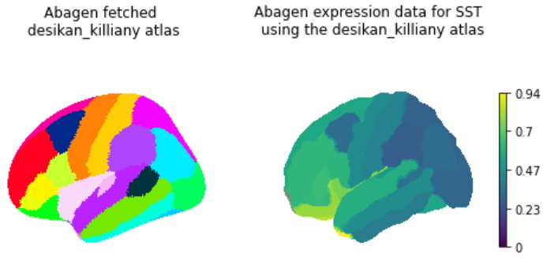

# BrainOrg

This repository contains different scripts that exemplify working with brain organization or (potentially) try to replicate previous findings. [work in progress]

## Plotting Abagen Gene Expression Data

Jupyter Notebook: [ipynb](abagen_extract_and_plot_gene_data.ipynb), [html](https://htmlpreview.github.io/?https://github.com/rscgh/brainorg/blob/main/html/abagen_extract_and_plot_gene_data.html)

## Html version of jupyter notebooks
* [abagen_extract_and_plot_gene_data.html](https://htmlpreview.github.io/?https://github.com/rscgh/brainorg/blob/main/html/abagen_extract_and_plot_gene_data.html)
